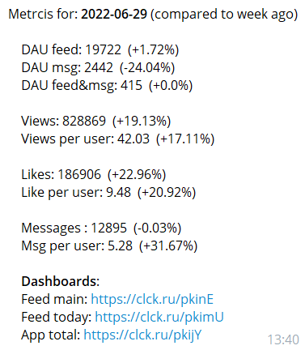

Здесь лежат python-скрипты, которые я написал:
- **скрипт для сбора метрик и отправки в телеграм**
Скрипт подключается к базе данных, выгружает необходимые данные, агрегирует их, собирает метрики, строит графики и отправляет в телеграм команде или ответственному сотруднику. Расписание настраивается через crontab или Gitlab CI/CD;

- **скрипт для системы алертов**
Скрипт каждые 15 минут обращается к базе данных и мониторит заданные метрики. Если возникла аномалия, скрипт отправляет оповещение в телеграм команде или ответственному сотруднику.
