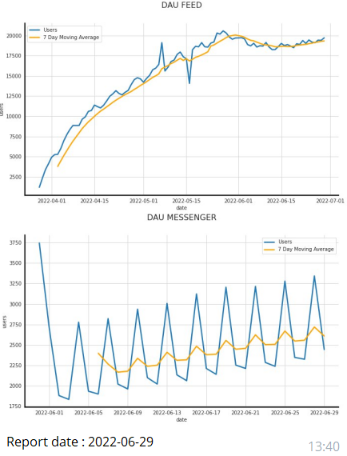

Здесь лежат python-скрипты, которые я написал:

- **скрипт для ежедневного отчета по ключевым показателям и отправки отчета в телеграм**
Скрипт подключается к базе данных, выгружает данные за предыдущий день, агрегирует их, собирает метрики, строит графики и отправляет в телеграм команде или ответственному сотруднику. Расписание настраивается через crontab или Gitlab CI/CD.
Получается отчет вида:

- **скрипт для сбора метрик за заданный период и отправки отчета в телеграм**
Скрипт подключается к базе данных, выгружает необходимые данные, агрегирует их, собирает метрики, строит графики и отправляет в телеграм команде или ответственному сотруднику. Расписание настраивается через crontab или Gitlab CI/CD.
Получается отчет вида:

С графиками по заданным метрикам:

- **скрипт для системы алертов**
Скрипт каждые 15 минут обращается к базе данных и мониторит заданные метрики. Если возникла аномалия, скрипт отправляет оповещение в телеграм команде или ответственному сотруднику.
